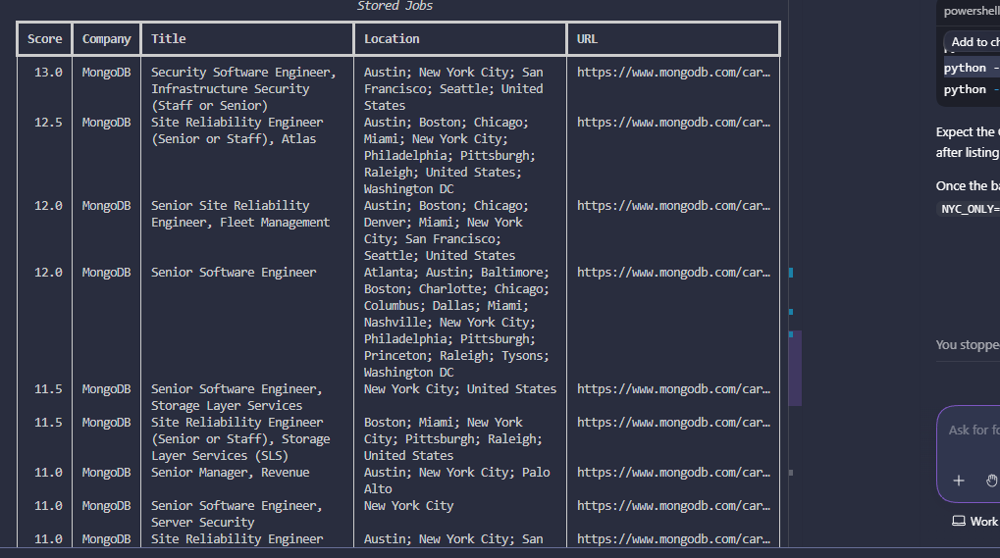
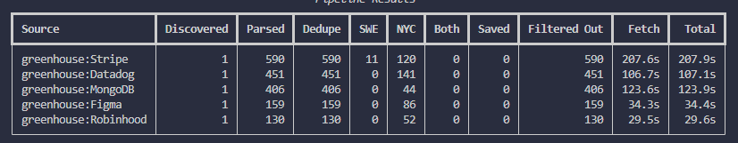

# nyc-job-scraper

click here to jump to the running portion [How To Run](#to-run)

src/job hunter/sources provides adapters for each job source, which keeps them isolated from one another
pipeline/ turns raw postings into comparable job objects after cleaning up the data. 
    flow: discover ==> fetch ==> parse ==> normalize ==> dedupe ==> enrich ==> rank
filters is self explanatory, swap the files out for what you want if you use this
taxonomy is just normalization of similar job positions
storage is database layer for SQlite to postgres
services is outputs for exports or alerts for new postings 

3 focused source handlers 
- structured ATS sources
- public city/company career pages
- a fallback to html scrapers

core scraped object should look like the following
JobPosting
- id
- source
- source_job_id
- title
- company
- location
- remote_policy
- job_url
- apply_url
- description 
- posted_at
- scraped_at
- salary_min
- salary_max
- currency
- tags
- score
- is_swe_relevant
- is_nyc_relevant

For canonic job models look to [Models Page](src/job_hunter/core/models.py)
    - this helps normalize an internal object across multiple different sources, so a lever and workday object look the same.
    - metadata helps find source specific junk without forcing it into main schema

Every source should answer some basic questions:
    - where do i discover the jobs
    - how do i fetchyour job page or job api responses
    - how do i parse it into the above mentioned object
[The Base Page](src/job_hunter/sources/base.py) answers this

## Company registry

Companies are configured in [companies.yaml](src/job_hunter/config/companies.yaml). Each entry
contains a company name, its ATS provider, and the provider's public board token. Add a company
only after confirming its board token works. The current registry has Greenhouse and Lever entries;
the other provider adapters are planned but not yet implemented.

Some entries also have a `headquarters` field. It is informational metadata for curating the
registry; it does not replace the location-based NYC filter applied to individual job postings.
The `group: large_company` label is likewise curation metadata, not a live S&P 500 membership
claim.

filtering modules can be found in the filtering folder, seperate from source. give ways to add to score instead of completely remove in a binary
[SWE Filters](src/job_hunter/filters/swe.py)
[NYC Filters](src/job_hunter/filters/nyc.py)

The DB works by getting the source adapter, taking the created job posting object, creating a connection and store it in the database  
    source adapter --> job object --> repository --> database

prevents scraping code from building sql strings directly, rather it creates instances of the job object and passes it to repo

# to run
1. Create a virtual environment
    >py -3.13 -m venv .venv 
    >.\.venv\Scripts\Activate.ps1 
2. Ensure pip is upgraded and all environmental variables and packages are set
    >python -m pip install --upgrade pip 
    >python -m pip install -e ".[dev]" 
    >$env:SWE_ONLY = "false" 
    >$env:NYC_ONLY = "false"

Note: Does not have to be false, nor strictly these two variables

3. run the script
    >python -m job_hunter run --source greenhouse

Use the --source tag to parse a specific job board. Here im using my greenhouse tag

4. parse the data
    >python -m job_hunter stats 
    >python -m job_hunter list --limit 20 
    >python -m job_hunter export --output data/exports/jobs.csv

The stats call should return something similar to the following Dashboard
>Dashboard
>total_jobs: 1692
>swe_jobs: 11
>nyc_jobs: 493
>top_companies:
>  - Stripe: 565
>  - Datadog: 432
>  - MongoDB: 411
>  - Figma: 160
>  - Robinhood: 124

Below is a screenshot of the limited list:

This WILL run slow since the payloads include indiviual job details after listing each board. 

# Update 1:
Normalizing location-first job searching
Before this, the workflow worked as such:
greenhouse.py will extract the location.name information, as well as description information
--> normalize.py will trim and normalize the text --> erich.py will call is_nyc_job on job location and description
--> nyc.py contains the actual rule of 
> text = f"{location or ''} {description}".lower() 

This will search the combined text for nyc, new york, manhattan, brooklyn, etc --> enrich.py will remove those whos variable "is_nyc_relevant" = false

Lets change it to be location first, and potentially only search descriptions if a location is absent and or listed as remote.

Added tests as well; Run the following commands in your virtual enviornment
> python -m pip install -e ".[dev]" 
> python -m pytest tests/unit/test_nyc_filter.py -q

# Update 2: Metrics for parsed jobs + timing instrumentation
I wanted to add these metrics so I can track whats being filtered out vs kept in, and why. It's important to ensure that no jobs are being incorrectly cut or incorrectly kept in. 

Theres also metrics for timing, simply because some processes take too long and I wanted to see where the bottleneck is (probably just numbers). Next update will focus on titlebase screening to quickly identify and eliminate positions that dont have an obvious software name. This should save time from parsing every description and simply eliminating anything with a "marketing" title but no "engineer" title. It will, of course, check to make sure the job isnt "marketing engineer" before eliminating.

Key changes are in enrich, runner, cli, and db. You can directly view the metrics test in the [Test Filter Metrics file](tests/unit/test_filter_metrics.py).

You can view stored metrics in [Source_runs.metrics_json](data/job_hunter.db) inside of the job hunter db.

A table similar to the following should appear:

Showing how 11 Jobs were marked as SWE, 120 as NYC, but none of them overlapped, so nothing was saved. Observing the data, I can tell that the SWE marker is incorrect, so the next update will focus on that. 

# September Update

For the updated SWE marker, its implementation is somewhat similar to the NYC change.

### To run

First, set these env variables to track metrics and store in a fresh DB (preventing any overlap)

>$runId = Get-Date -Format "yyyyMMdd_HHmmss" 
>$env:DB_PATH = "data\runs\job_hunter_$runId.db" 
>$env:SWE_ONLY = "true" 
>$env:NYC_ONLY = "true"

After that you can simply run the following commands. the first one tracks the tests output and the second one is the command that we've been running from the start

>python -m pytest tests/unit -q 
>python -m job_hunter run --source greenhouse

In the same enviornment with your DB path, run this command to show anything that got past the filters. In this, I set the limit to 100 as I can see that only 32 passed the test. You can change this if youd like, but 100 should be a good benchmark number:

> python -m job_hunter list --limit 100 

To export, run this:

>python -m job_hunter export --output "data\exports\jobs_$runId.csv" 

You'll want to export it as the links in the terminal wont fully work due to length/privacy reasons. The exported CV will have full working links.

Make sure to clear the terminaly only overrides so it returns to defaults after running the commands.

>Remove-Item Env:DB_PATH 
>Remove-Item Env:SWE_ONLY 
>Remove-Item Env:NYC_ONLY 

Notes from this run:
Datadog is returning 0 SWE jobs. If you know Datadog, you know this isnt right. I'll reiterate through and see what the job titles include in the header, and overlay it with my filters to see what needs to be adapted.

# 9/10

### Filter/audit report
I dont know why datadog is not showing any jobs, so Im going to create an audit output to record the rejected titles + location (if NYC is enabled) and the job url so I can exam the job description/listing itself.

Could potentially add a variable that signifies WHEN a job was cut off, and paste it into the report.

Two new flags:
    --audit
    --audit-output

Output will be stored in a csv file in a data/audits, specify with path in data after --audit-output

>python -m job_hunter run --source greenhouse 
>--audit-output data/audits/greenhouse_audit.csv

Using this, we're going to run a datadog audit

>python -m job_hunter run --source datadog --audit-output data/audits/datadog_audit.csv

You can also use other companies like Figma, Strip, MongoDB by specifiying after --source

I cross referenced the audit with greenhouse and saw some failing filters cause of words like "developer" or "web engineer" not specifically referencing software in the title. I figured its better for me to look through the job applications myself and decide which to keep and not to keep.

For the future, if you want a more thorough detailed filter, turn on 
> fetch_details: bool = False,  
to  
>fetch_details: bool = True,

in [Greenhouse.py](src/job_hunter/sources/greenhouse.py). Disable the name check in swe filter, and it should return a thorough check. 

I used Codex to sift through the audit reports and find names that were being filtered out, even if they were located in NYC, that should obviously be included. I wrote the variables into the filter storage.

## Readable Markdown files

Run the command 

>python -m job_hunter report data/exports/your_jobs.csv --output data/reports/your_shortlist.md

to get the output of the saved jobs as a markdown file.

Or simply, follow the following pipeline:

Get the jobs --> export data --> turn to markdown

>python -m job_hunter run --source greenhouse  
>python -m job_hunter export --output data/exports/jobs.csv  
>python -m job_hunter report data/exports/jobs.csv --output data/reports/greenhouse_shortlist.md
